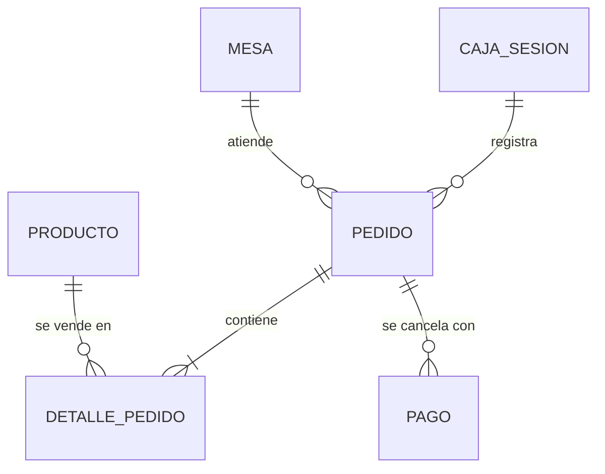

# Modelo de datos (IndexedDB con Dexie.js)

## Esquema (`src/db/database.js`)
```js
import Dexie from 'dexie';

export const db = new Dexie('PosCafeteriaDB');

db.version(1).stores({
  cajaSesion:    '++id, estado, fechaApertura',
  mesas:         '++id, numero, estado',
  productos:     '++id, categoria, activo',
  pedidos:       '++id, &codigoVenta, cajaSesionId, mesaId, estado, fechaHora',
  detallePedido: '++id, pedidoId, productoId',
  pagos:         '++id, pedidoId, metodo'
});
```
En Dexie solo se declaran los campos indexados. Los demás campos se guardan igual en cada objeto. Para cambios futuros se agrega `db.version(2).stores({...}).upgrade(...)`.

## Stores y campos
**cajaSesion**: `id`, `fechaApertura`, `fechaCierre`, `montoInicial`, `montoCierreEfectivo`, `montoCierreTarjetas`, `diferencia`, `estado` (`'ABIERTA' | 'CERRADA'`).

**mesas**: `id`, `numero`, `capacidad`, `estado` (`'LIBRE' | 'OCUPADA'`), `posX`, `posY`. La mesa con `id = 0` es virtual ("Para llevar").

**productos**: `id`, `nombre`, `categoria` (`'CALIENTES' | 'FRIAS' | 'REPOSTERIA'`), `precio` (céntimos), `imagen` (ruta WebP), `activo`.

**pedidos**: `id`, `codigoVenta` (único, `VEN-AAAA-XXXX`), `cajaSesionId`, `mesaId`, `tipoPedido` (`'COMER_AQUI' | 'PARA_LLEVAR'`), `estado`, `subtotal`, `igv`, `total` (céntimos), `fechaHora`.

**detallePedido**: `id`, `pedidoId`, `productoId`, `cantidad`, `precioUnitario` (céntimos), `nota`.

**pagos**: `id`, `pedidoId`, `metodo` (`'EFECTIVO' | 'YAPE' | 'TARJETA'`), `montoRecibido`, `montoCobrado`, `vuelto` (céntimos).

## Relaciones


## Reglas de integridad
- IndexedDB no tiene claves foráneas ni cascada: la integridad se garantiza en los repositorios, agrupando operaciones relacionadas en una transacción.
- Registrar una venta:
```js
await db.transaction('rw', db.pedidos, db.detallePedido, db.pagos, db.mesas, async () => {
  const pedidoId = await db.pedidos.add(pedido);
  await db.detallePedido.bulkAdd(detalles.map((d) => ({ ...d, pedidoId })));
  await db.pagos.add({ ...pago, pedidoId });
  if (pedido.mesaId !== 0) await db.mesas.update(pedido.mesaId, { estado: 'LIBRE' });
});
```
- Dentro de la transacción solo se esperan operaciones de Dexie (no `fetch` ni otras promesas).
- Solo debe existir una `cajaSesion` con `estado = 'ABIERTA'` a la vez.
- Los montos son enteros en céntimos; se formatean a soles solo en la interfaz.

## Datos iniciales (`seed.js`)
- Mesa 0 (virtual, "Para llevar") y mesas 1 a 9 en estado LIBRE, con `posX` y `posY` para el plano.
- Catálogo de ejemplo en las 3 categorías, con precios en céntimos e imágenes WebP.
- El seed solo se ejecuta si el store `productos` está vacío.
